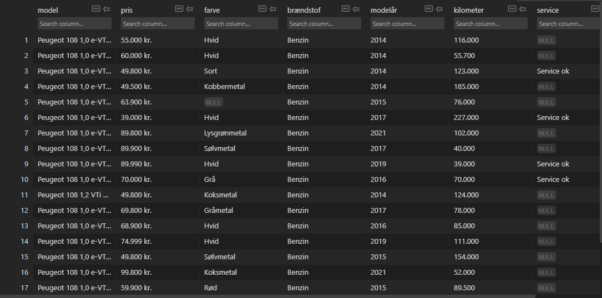

# Scrapydba
Python Webscraping using Scrapy Framework with HTML visual. <br />
Free to use and modify by all parties without CC. <br />
Secondary method of same program <br />
Made due to difference of database structure of existing network <br />

# How To Run <br />
* Install Scrapy Framework <br />
```$ pip install scrapy```

* python scrapydba/scrapydba/spiders/bilspider.py <br />
^ Runs the spider

* python csvdataparse.py <br />
^ Creates a HTML for better visual over data



<br />
<br />
<br />
<br />

In Memories of Nicklas x Bekir <br />
© 2024 Full Copyright disclosure, Joller aka LexRoZa Inc. All Rights Reserved. 
